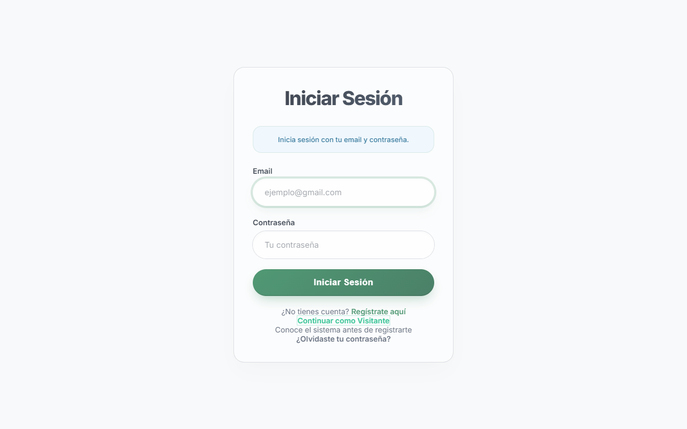
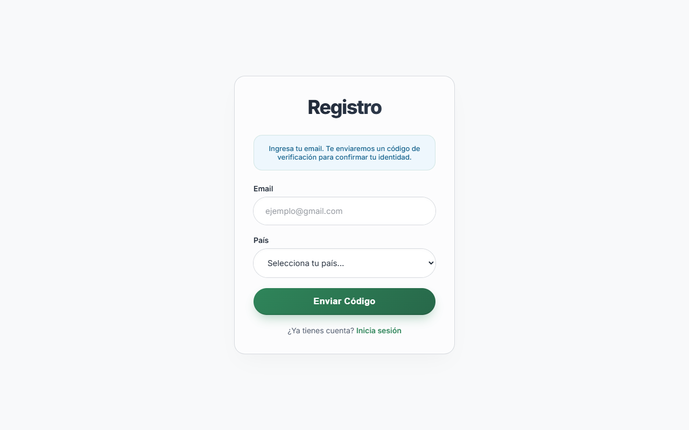
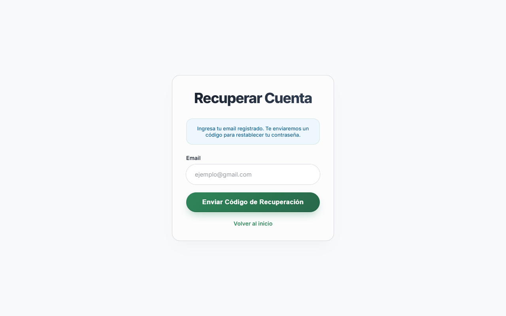
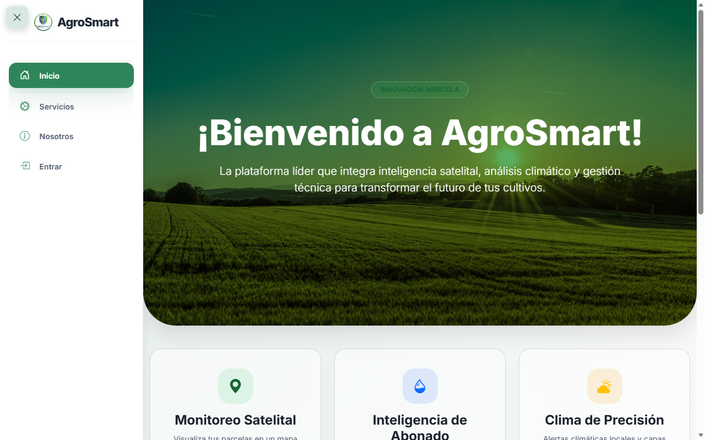
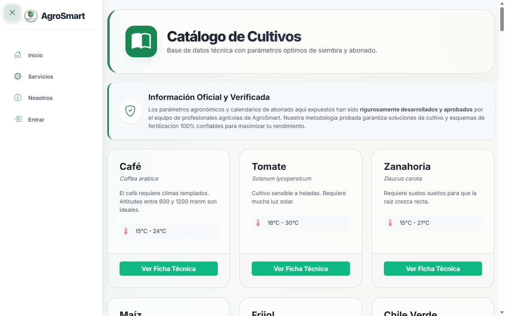
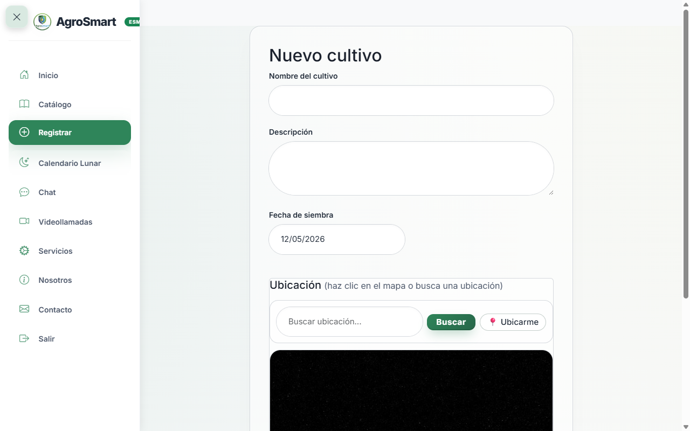
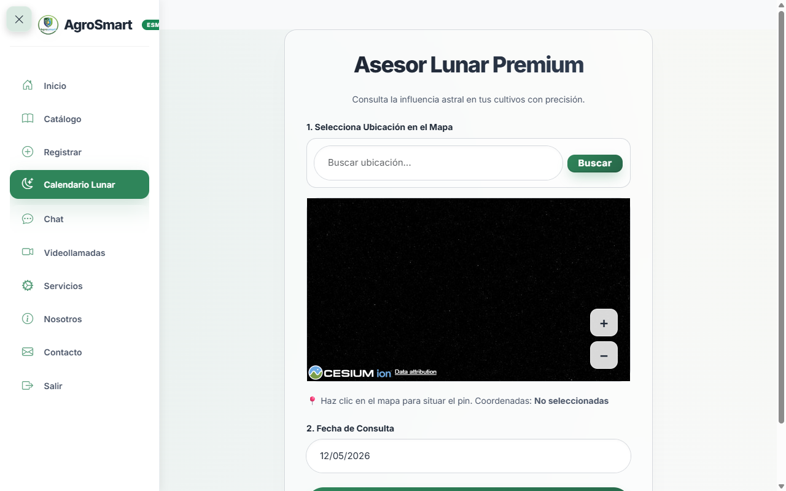
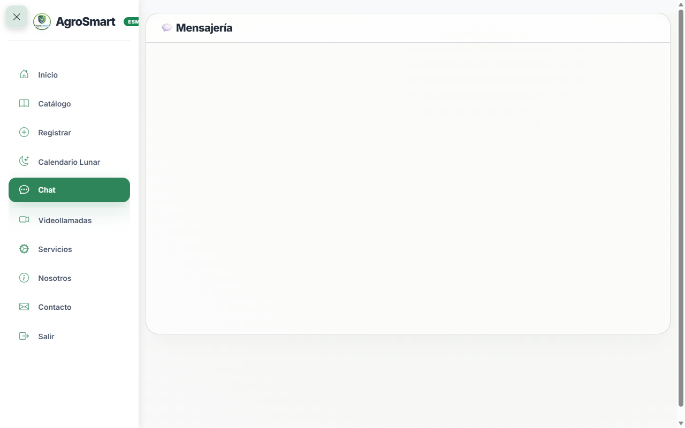
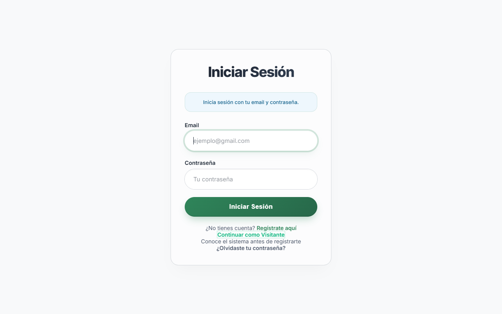

# Manual de Usuario - AgroSmart
**Ecosistema de Gestión Agrícola Integral**

---

## Índice
1. [Introducción al Sistema](#1-introducción-al-sistema)
2. [Gestión de Acceso y Cuenta](#2-gestión-de-acceso-y-cuenta)
   - 2.1. Iniciar Sesión
   - 2.2. Registro y Verificación (OTP)
   - 2.3. Recuperación de Contraseña
3. [Navegación y Membresías (Mi Plan)](#3-navegación-y-membresías-mi-plan)
4. [Panel de Control (Dashboard)](#4-panel-de-control-dashboard)
   - 4.1. Resumen de Mis Cultivos
   - 4.2. Mapa Meteorológico 3D Interactívo
5. [Gestión Inteligente de Cultivos](#5-gestión-inteligente-de-cultivos)
   - 5.1. Catálogo Técnico
   - 5.2. Registro de Nuevas Parcelas
   - 5.3. Plan Automático de Fertilización
6. [Asesor Lunar Premium](#6-asesor-lunar-premium)
   - 6.1. Sincronización Astral
   - 6.2. Recomendaciones de Siembra y Cosecha
7. [Ecosistema de Comunicación](#7-ecosistema-de-comunicación)
   - 7.1. Sistema de Mensajería (Chat)
   - 7.2. Asistencia Técnica (Videollamadas)
8. [Consideraciones Críticas y Modo Offline](#8-consideraciones-críticas-y-modo-offline)

---

## 1. Introducción al Sistema

Bienvenido a **AgroSmart**, la plataforma de inteligencia agrícola diseñada para transformar sus labores de campo mediante tecnología satelital y análisis de datos en tiempo real. Este ecosistema le permite no solo registrar la historia de sus parcelas, sino obtener asistencia técnica automatizada, notificaciones de fertilización, estudios lunares y contacto directo con su cooperativa o técnicos agrícolas.

Este manual le guiará paso a paso por todas las herramientas disponibles para su rol como Agricultor o Productor.

---

## 2. Gestión de Acceso y Cuenta

El ingreso a AgroSmart cuenta con niveles de seguridad estrictos para proteger la información de sus siembras.

### 2.1. Iniciar Sesión

Si usted ya posee una cuenta registrada por su organización:
1. Abra su navegador web y diríjase a la plataforma AgroSmart.
2. En la pantalla principal, ingrese su **Correo Electrónico** y **Contraseña**.
3. Haga clic en **"Iniciar Sesión"**. 
4. *Nota: Si es su primer ingreso en un dispositivo nuevo, es posible que el sistema le muestre un cartel de bienvenida confirmando su rol y el plan de su país.*

### 2.2. Registro y Verificación (OTP)

Si necesita crear una cuenta nueva y su país lo permite:
1. En la pantalla de login, haga clic en el enlace inferior: **"¿No tienes cuenta? Regístrate aquí"**.
2. Seleccione su país de residencia e ingrese su correo electrónico.
3. El sistema le enviará un código de 6 dígitos a su correo. Introdúzcalo en la pantalla de verificación (Código OTP).

4. Finalmente, cree y confirme su nueva contraseña segura (mínimo 6 caracteres).

### 2.3. Recuperación de Contraseña

Si olvida sus credenciales:
1. Haga clic en **"¿Olvidaste tu contraseña?"** desde la pantalla principal.
2. Ingrese su correo registrado. Recibirá un nuevo código numérico de seguridad.
3. Al validarlo, el sistema le pedirá crear una nueva contraseña.

---

## 3. Navegación y Membresías (Mi Plan)

El menú izquierdo (Navbar) es su brújula dentro de AgroSmart. Sin embargo, las opciones que usted vea dependerán directamente del **Plan de Membresía** que su país o cooperativa haya adquirido.

* **Etiqueta de Plan:** En la esquina superior izquierda, justo al lado del logo de AgroSmart, verá su nivel de licencia actual (Básico, Bronce, Platinium, Diamante o Esmeralda).
* **Menú Dinámico:** El sistema habilitará automáticamente botones especiales si usted tiene una membresía alta. Por ejemplo, el botón de **"Videollamadas"** solo estará visible si cuenta con un plan Diamante o Esmeralda.
* **Notificaciones Numéricas:** Al lado del botón "Chat", aparecerá un globo rojo con un número si tiene mensajes sin leer de sus compañeros.

---

## 4. Panel de Control (Dashboard)

Una vez iniciada la sesión con éxito, será llevado a su **Dashboard**. Esta es la pantalla más completa del sistema y funciona como su centro de mando.

### 4.1. Resumen de Mis Cultivos
En la parte media superior, verá tarjetas con la información resumida de cada una de sus parcelas activas:
- **Nombre y Descripción:** Tipo de cultivo y detalles técnicos que ingresó.
- **Fecha de Siembra:** Calculada para llevar el tiempo exacto del ciclo.
- **Botones Rápidos:** 
  - **Abonado:** Le lleva directamente al cronograma de aplicación de químicos.
  - **Editar/Ver:** Permite cambiar la información del cultivo.
  - **Eliminar:** Borra el registro si la parcela fue descartada o finalizada.

### 4.2. Mapa Meteorológico 3D Interactívo
La parte inferior del Dashboard incluye un espectacular **globo satelital en 3D**.
- **Pines y Clusters:** Verá hojas verdes marcando la ubicación exacta de sus cultivos. Si hay muchos cultivos juntos, verá un círculo agrupando la cantidad. Al hacer clic sobre los pines, se abrirá un globo informativo con detalles de esa siembra específica.
- **Buscador de Terrenos:** Utilice la barra de búsqueda en el mapa para acercar la cámara satelital a sus coordenadas exactas antes de crear un nuevo cultivo.
- **Capas de Clima (Si el plan lo incluye):** Si tiene internet, el mapa mostrará en tiempo real las nubes y proyecciones climáticas sobre sus terrenos.

---

## 5. Gestión Inteligente de Cultivos

Esta es la herramienta más poderosa del sistema: no solo guarda sus datos, sino que automatiza su trabajo de campo.

### 5.1. Catálogo Técnico

Antes de registrar, puede visitar el **Catálogo** en el menú. Aquí encontrará la enciclopedia técnica oficial de AgroSmart con todos los cultivos soportados. Verá sus características climáticas, rendimientos esperados y, lo más importante, el *Plan Estándar de Fertilización* requerido para cada planta.

### 5.2. Registro de Nuevas Parcelas

Para agregar un nuevo terreno a su mando:
1. Haga clic en **"Registrar"** en su menú lateral.
2. Ingrese el **Nombre del Cultivo** (asegúrese de usar un nombre exacto que esté en el catálogo, como *Maíz*, *Frijol*, *Café*).
3. Seleccione la fecha de siembra en el calendario.
4. Elija sus coordenadas. Si tiene su GPS encendido, el sistema puede auto-detectar su ubicación en el campo.
5. Al hacer clic en "Guardar Parcela", el sistema hará magia en el fondo.

### 5.3. Plan Automático de Fertilización
El mayor beneficio de registrar correctamente su cultivo es el **Plan de Abonado**. Cuando el sistema detecta que usted sembró, por ejemplo, "Maíz", creará automáticamente en su base de datos todas las fechas en las que usted debe aplicar fertilizante durante los próximos meses, calculando los días desde la fecha de siembra que indicó.

---

## 6. Asesor Lunar Premium

AgroSmart honra el conocimiento ancestral combinándolo con la tecnología moderna para garantizar que sus decisiones de siembra estén en el mejor momento astronómico.

### 6.1. Sincronización Astral
1. Ingrese a la sección **"Calendario Lunar"**.
2. Busque sus tierras en el mapa y haga clic para dejar el pin amarillo (esto permite calcular las horas exactas de salida del sol y de la luna para su zona).
3. Seleccione la fecha que desea investigar en el calendario y haga clic en **Analizar Ciclo Astral**.

### 6.2. Recomendaciones de Siembra y Cosecha
El sistema le revelará la fase de la luna, el porcentaje de iluminación y las horas exactas de la salida/puesta del sol. Con base en esta información:
- **Luna Nueva:** Ideal para mantenimiento, poda, y aplicación de abonos o tratamientos de raíces. El crecimiento de las hojas es mínimo.
- **Cuarto Creciente:** Recomendado para sembrar cultivos que crecen sobre el suelo (tomate, pimiento, maíz). La savia asciende con fuerza.
- **Luna Llena:** Ideal para la **cosecha**. Las plantas concentran la mayor cantidad de nutrientes y agua en la parte superior.
- **Cuarto Menguante:** Recomendado para sembrar cultivos de raíz o tubérculos (zanahoria, rábano, papa). La savia desciende hacia las raíces.

---

## 7. Ecosistema de Comunicación

Usted nunca estará solo trabajando sus tierras. AgroSmart ha integrado potentes herramientas para mantenerlo en contacto.

### 7.1. Sistema de Mensajería (Chat)

En la sección **"Chat"**, encontrará dos áreas:
1. **Chat Directo**: Comuníquese individualmente con cualquier técnico o administrador de su cooperativa. Use el buscador para encontrar a la persona e inicie una conversación.
2. **Grupos Cooperativos**: Podrá crear grupos con otros agricultores vecinos para organizar envíos o compras conjuntas de fertilizante. El historial de mensajes se resguarda de manera local y en la nube.

### 7.2. Asistencia Técnica (Videollamadas)

*Solo disponible para planes Diamante y Esmeralda.*
Si encuentra una plaga desconocida en su cultivo o necesita asistencia agronómica en vivo:
1. Navegue a la sección **"Videollamadas"**.
2. Ingrese el ID de la sala que le proporcionó su técnico o cree una nueva.
3. El sistema conectará su cámara web (o la de su dispositivo móvil) en tiempo real, permitiendo mostrarle el terreno al ingeniero agrónomo sin que este deba viajar físicamente hasta la parcela.

---

## 8. Consideraciones Críticas y Modo Offline

- **Resiliencia en Zonas Rurales (Modo Offline):** AgroSmart entiende que en el campo la señal de internet puede ser nula. Si pierde conexión, la aplicación seguirá activa. Podrá seguir navegando por su Dashboard, revisando su catálogo y consultando el calendario. El sistema guardará todos sus cambios internamente y los sincronizará a la base de datos nacional cuando recupere la señal celular o Wi-Fi.
- **Sanciones Automáticas:** Si incumple políticas técnicas o de comportamiento en el chat, un administrador gubernamental o de la cooperativa puede suspender su cuenta. Si esto ocurre, la próxima vez que abra la aplicación será redirigido a una pantalla de bloqueo donde podrá escribir una carta de apelación para recuperar su acceso.

---
*© 2026 AgroSmart Corporation. Infraestructura Agrícola Confidencial. Todos los derechos reservados.*
